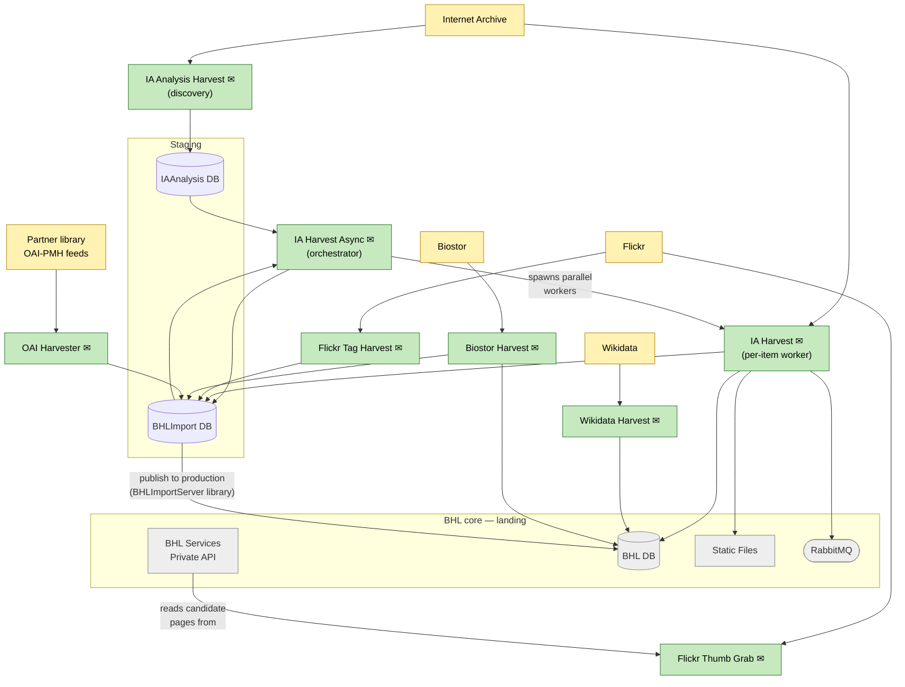

# Ingest

How content and metadata enter BHL from external systems. Scope: the external sources, the harvester that pulls from each one, the staging databases records pass through before promotion, and the BHL-core boundary nodes where ingested data lands.

External sources and their harvesters are drawn independently — they're unrelated systems with distinct pipelines. BHL-core landing nodes are shown muted to keep the reader focused on the ingest path; their internal behaviour belongs in the Process and Serve sub-diagrams.

## How each pipeline works

- **IA (three-stage)** — a discovery / orchestration / worker split:
  1. **`IA Analysis Harvest`** polls the Internet Archive OAI API, pulls metadata and MARC records for new or changed items, and writes them to **`IAAnalysis DB`**. Runs standalone on a schedule, one month of IA activity per pass.
  2. **`IA Harvest Async`** is the orchestrator. It transfers rows from `IAAnalysis DB` into the `IAItem` queue in `BHLImport DB`, then spawns multiple `IA Harvest.exe` child processes in parallel. It does no harvesting itself — its job is just to dispatch work and track sets.
  3. **`IA Harvest`** is the per-item worker. Called with phase flags (`/DOWNLOAD`, `/UPLOAD`, `/PUBLISH`), it fetches DJVU/MARC/scandata/OCR files from Internet Archive, writes them to **Static Files**, stages page-level records in **`BHLImport DB`**, sends messages to **RabbitMQ** (which drive the Search Indexer and PDF generator in Process), and promotes records into **BHL DB** via the shared `BHLImportServer` library (direct DB writes, not REST).

  The split lets each stage scale and fail independently — discovery is light and frequent; the orchestrator controls concurrency; the workers do the heavy lifting in parallel.
- **Flickr** — two harvesters. `Flickr Tag Harvest` scans Flickr photos for machine tags linking back to BHL pages and stages matches in `BHLImport DB`. `Flickr Thumb Grab` pulls thumbnails and submits them via the Private API.
- **Wikidata** — `Wikidata Harvest` pulls bibliographic / authority data and commits via the Private API.
- **Biostor** — `Biostor Harvest` pulls article / reference records, stages in `BHLImport DB`, and commits via the Private API.
- **Partner OAI-PMH** — `OAI Harvester` is a generic harvester driven by configured sets in `BHLImport DB` (`vwOAIHarvestSet`); each set points at a partner library's OAI-PMH endpoint. Records land in `BHLImport DB` and are later published to production via `OAIRecordPublishToProduction`.

## Operational endpoint (not drawn)

All harvesters make two classes of Private API call that are *not* shown on the diagram:

- **`/v1/InsertServiceLog`** — operational audit logging at the start / end of each run, via the shared `ServiceLogsClient`.
- **`/v1/Email/Send`** — completion / error notifications via `EmailClient` (marked ✉ on the nodes above).

These are ops and notifications rather than harvested-data flow, so drawing eight-plus identical edges to a `Private API` node would add clutter without information. The one genuine data call that *is* drawn is **Flickr Thumb Grab**'s `/v1/PageFlickr/Random` read — it's the only harvester that reads anything from the Private API.

A consequence: the "Private API as write gateway" story — the idea that harvested data reaches BHL DB through the Private API — is **not** how ingest actually works. Harvesters write directly to the databases through `BHLImportServer` (for staging) and `BHLProvider` (for BHL DB). The integration-seams view flags this as a weakness in the Private API's modularity.

## Staging databases

- **`BHLImport DB`** — the general staging layer. Every ingest path except IA's file-fetch step writes raw / partial records here; `BHLImportServer` (a shared .NET class library, not a service) is the data-access wrapper used by the harvesters.
- **`IAAnalysis DB`** — specific to the IA pipeline. Decouples the "what's new on IA?" analysis step from the heavier fetch-and-stage step, so the two can run on different schedules.

## Hand-off to Process

The ingest pipeline lands data in three places that the Process sub-diagram picks up from:

- **BHL DB** — the primary production target, written directly via `BHLProvider` / `BHLImportServer`.
- **Static Files** — DJVU, scandata, MARC, raw OCR from IA.
- **RabbitMQ** — index-and-PDF messages emitted by IA Harvest.

## What's not shown here

- `Text Import Processor` and `OCR Refresh` can *look* like ingest because they produce OCR files, but they operate on items already in BHL — they live in the Process sub-diagram.
- Macaw is not an ingest path to BHL. Partner-institution content authored in Macaw reaches BHL only via Internet Archive, picked up by IA Harvest like any other IA item (see overview).
