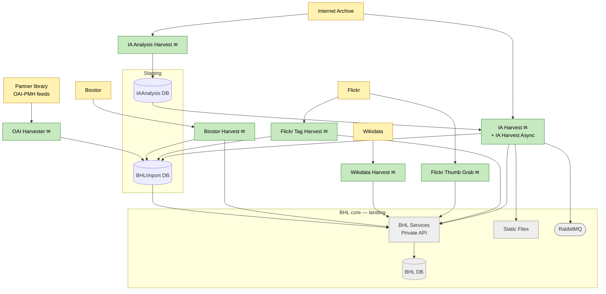

# Ingest

How content and metadata enter BHL from external systems. Scope: the external sources, the harvester that pulls from each one, the staging databases records pass through before promotion, and the BHL-core boundary nodes where ingested data lands.

External sources and their harvesters are drawn independently — they're unrelated systems with distinct pipelines. BHL-core landing nodes are shown muted to keep the reader focused on the ingest path; their internal behaviour belongs in the Process and Serve sub-diagrams.

## How each pipeline works

- **IA (two-stage)** — `IA Analysis Harvest` reads item/date metadata from Internet Archive and writes it into `IAAnalysis DB`. `IA Harvest` (and its newer sibling `IA Harvest Async`) reads that signal, then pulls DJVU/MARC/scandata/OCR files from IA, writes files to `Static Files`, stages records in `BHLImport DB`, sends messages to RabbitMQ (which drive the Search Indexer and PDF generator in Process), and commits through the Private API.
- **Flickr** — two harvesters. `Flickr Tag Harvest` scans Flickr photos for machine tags linking back to BHL pages and stages matches in `BHLImport DB`. `Flickr Thumb Grab` pulls thumbnails and submits them via the Private API.
- **Wikidata** — `Wikidata Harvest` pulls bibliographic / authority data and commits via the Private API.
- **Biostor** — `Biostor Harvest` pulls article / reference records, stages in `BHLImport DB`, and commits via the Private API.
- **Partner OAI-PMH** — `OAI Harvester` is a generic harvester driven by configured sets in `BHLImport DB` (`vwOAIHarvestSet`); each set points at a partner library's OAI-PMH endpoint. Records land in `BHLImport DB` and are later published to production via `OAIRecordPublishToProduction`.

## Email notifications

Every harvester posts a completion / error summary to `/v1/Email` on the BHL Services Private API at the end of its run (marked ✉ on the nodes above). To avoid cluttering the diagram with eight identical edges, those calls aren't drawn individually — they all land at the Private API, which forwards to SMTP (see overview).

## Staging databases

- **`BHLImport DB`** — the general staging layer. Every ingest path except IA's file-fetch step writes raw / partial records here; `BHLImportServer` (a shared .NET class library, not a service) is the data-access wrapper used by the harvesters.
- **`IAAnalysis DB`** — specific to the IA pipeline. Decouples the "what's new on IA?" analysis step from the heavier fetch-and-stage step, so the two can run on different schedules.

## Hand-off to Process

The ingest pipeline lands data in four places that the Process sub-diagram picks up from:

- **BHL DB** — the primary production target (written via the Private API).
- **Static Files** — DJVU, scandata, MARC, raw OCR from IA.
- **RabbitMQ** — index-and-PDF messages emitted by IA Harvest.
- **BHL Services Private API** — trivially, all writes flow through it.

## What's not shown here

- The IA Harvest source code is split across `IAHarvest/`, `IAHarvestAsync/`, and `IAAnalysisHarvest/`. Only the logical harvester roles are shown.
- `Text Import Processor` and `OCR Refresh` can *look* like ingest because they produce OCR files, but they operate on items already in BHL — they live in the Process sub-diagram.
- Macaw is not an ingest path to BHL. Partner-institution content authored in Macaw reaches BHL only via Internet Archive, picked up by IA Harvest like any other IA item (see overview).
