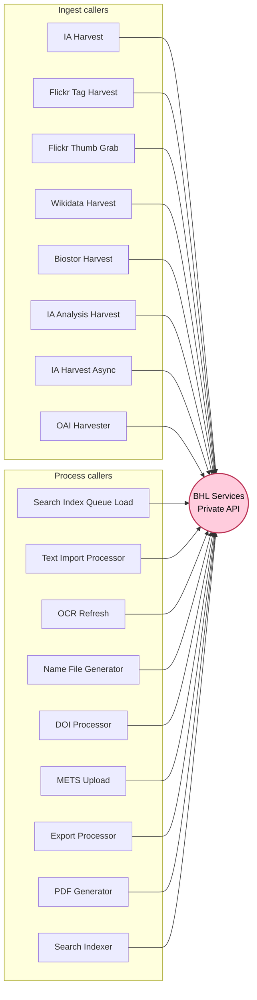
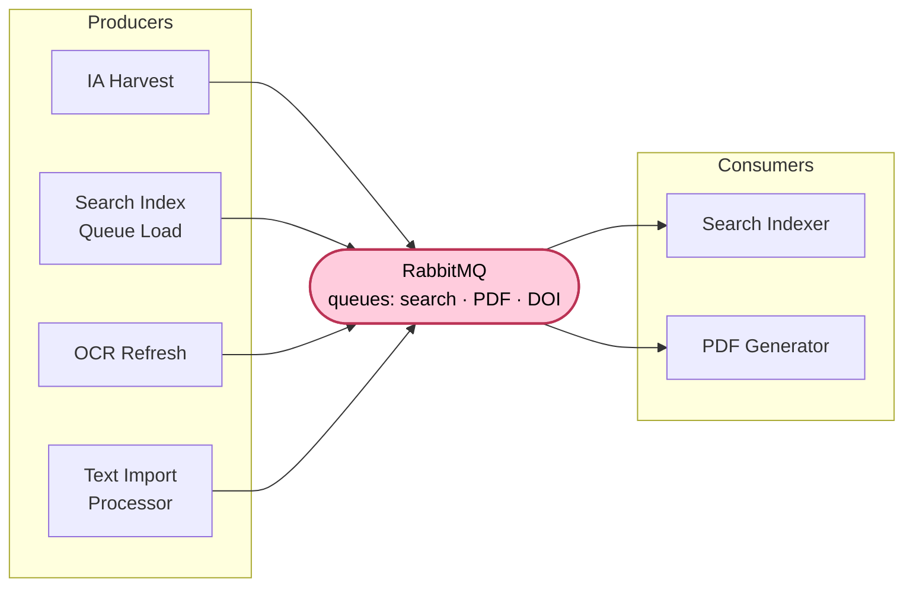
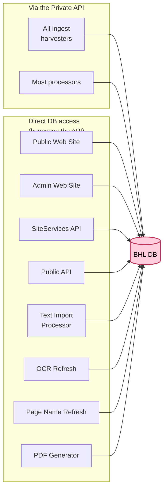
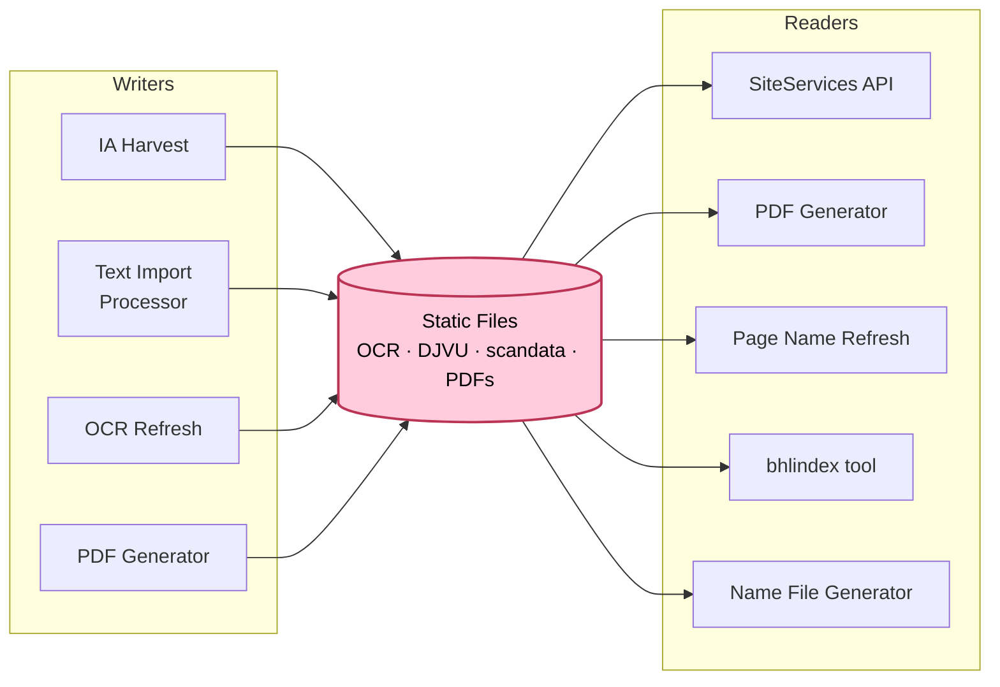
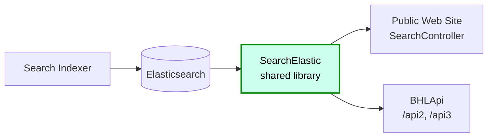
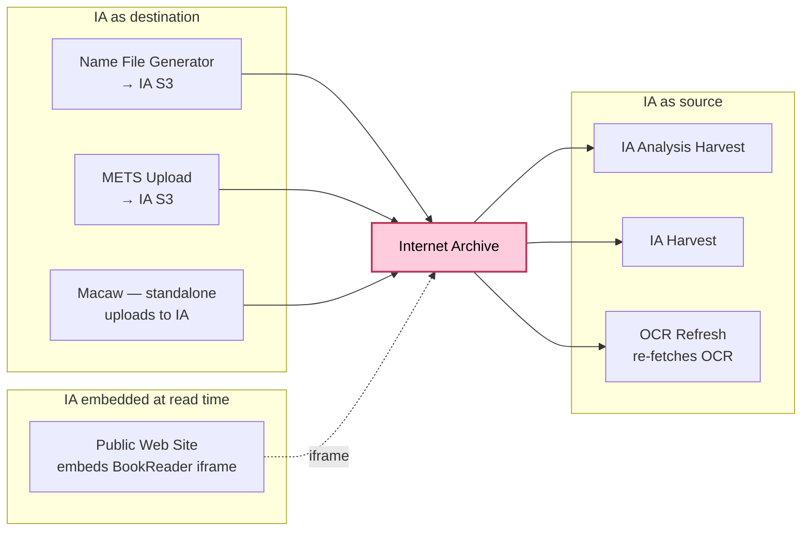
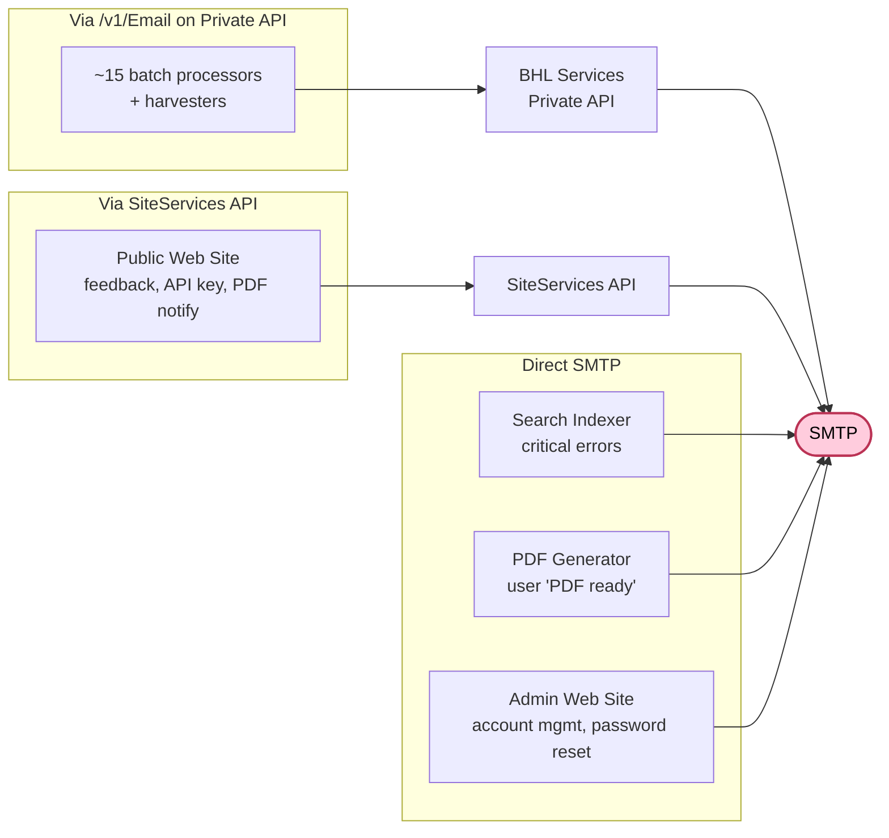

# Integration seams

The lifecycle diagrams (Ingest, Process, Serve) show *how data moves*. This view is orthogonal: it shows *where the joints are*. If BHL wants to evolve — swap a queue, replace a storage layer, split the monolith — the seams below are the places that change would touch.

Each section below gives a focused mini-diagram, who depends on the seam, and a short note on what moving it would cost.

## Seams at a glance

| Seam | Touch-points | Modularity today | Swap difficulty |
|------|--------------|------------------|-----------------|
| BHL Services Private API (write gateway) | ~17 ingest + process components | Decent protocol boundary, many callers | Medium — protocol is clean, fan-out is wide |
| RabbitMQ (async bus) | 4 producers, 2 consumers, ~3 queues | Clean producer/consumer split | **Low** — few parties, well-typed messages |
| BHL DB (SQL Server) | Everything; some via API, some direct | Weak — several components bypass the API and write directly | **High** — schema touches every subsystem |
| Static Files (file share) | Harvest + Process + SiteServices API | OK — path-based, but paths are scattered | Medium — would need a storage abstraction |
| Elasticsearch | 1 writer, 2 readers via shared library | **Strong** — `SearchElastic/` is the single seam | **Low** — swap the library's backend |
| Internet Archive | Source *and* destination *and* page-image host | Very tight — multiple, unmediated touch-points | **High** — structural dependency |
| SMTP / email | ~20 senders split three ways | OK — most centralised via `/v1/Email` | Medium — a few direct-SMTP outliers |

---

## 1 · BHL Services Private API — the write gateway

The Private API is the single HTTP endpoint most background jobs use to commit data (and send notification emails). In principle, moving to a different write path means updating every caller.

*(Some callers use the API only for email notifications, others for data writes, others for both. For modularity purposes the distinction doesn't matter — they all couple to the protocol.)*

- **What it is.** An internal REST surface (currently colocated with `BHLWebServiceREST.v1`; the split between "Public" and "Private" is logical, not a separate deployment). Wraps BHL DB writes and `/v1/Email` notification sending.
- **Swap notes.** The protocol itself is clean — every caller uses a small set of REST operations, so a replacement could preserve the interface shape (e.g. gRPC gateway, a message-based write bus). The fan-out is what makes it big: roughly 17 in-repo components would need re-pointing. In practice, a swap would be gradual: introduce the new endpoint, move harvesters one at a time, retire old routes.
- **Possible improvements.** Currently no caching, rate-limiting, or auth between callers and API (they run on the same network). A gateway layer could add those without touching callers.

---

## 2 · RabbitMQ — the async bus

The queue is used for a small, bounded set of interactions. This is BHL's strongest modularity story.

- **What it is.** RabbitMQ with separate queues for search-index, PDF, and DOI work. `Search Index Queue Load` is a general fan-out from BHL DB audit tables into all three queues; other producers fire messages directly.
- **Swap notes.** Only four producers and two consumers. Message payloads are simple strings like `itemtype|itemID|barcode`. Porting to Kafka, SQS, Azure Service Bus, or even Redis streams would be a straightforward drop-in — the hard work is operational (credentials, ordering, dead-letter handling), not interface redesign.
- **Opportunity.** If BHL adds new asynchronous behaviour (e.g. a recommendations pipeline, a citation-alerts service), MQ is the right integration point and the pattern is already established.

---

## 3 · BHL DB — the central SQL Server database

The biggest and tightest seam. Everything either reads or writes here, and the API-as-gateway pattern isn't strict — several processors and both web sites go through `BHLProvider` / `BHLCoreDAL` straight to the DB.

- **What it is.** A large SQL Server schema accessed through a shared `BHLServer` / `BHLCoreDAL` .NET library. Most tables are shared across subsystems; stored procedures handle a lot of business logic.
- **Swap notes.** In practice, changing the database engine itself is hard — the schema couples every subsystem, stored procedures aren't portable, and multiple code paths write directly. But *parts* of it could be peeled off: for example, moving the full-text search story entirely into Elasticsearch (and retiring DB-side search) is already partly done; moving name storage into a dedicated service is conceivable; splitting auth / accounts is another natural seam.
- **Key friction.** The "Private API as write gateway" pattern is only aspirational. `BHLPageNameRefresh`, `BHLTextImportProcessor`, `BHLOcrRefresh`, `BHLPDFGenerator` all write directly. So does the Admin Web Site. Before the API seam is strong enough to rely on for modularity, these bypasses would need routing through it.

---

## 4 · Static Files — the file share

Less glamorous, but heavily used.

- **What it is.** A shared filesystem (currently NAS-style) holding OCR text, DJVU files, scandata, pre-generated PDFs, and export files.
- **Swap notes.** Swapping to object storage (S3, Azure Blob) would mean replacing every path-based read/write with an SDK call. `SiteServicesAPI` already reads from AWS S3 for some artefacts (per the serve investigation), so the abstraction partly exists — making it universal would be the refactor.
- **Opportunity.** A unified file-access provider interface would also make it easier to mirror content to the AWS Open Data dataset consistently, rather than relying on external sync.

---

## 5 · Elasticsearch — the cleanest seam

- **What it is.** The `SearchElastic/` project is a single shared library that wraps all Elasticsearch interactions — used by the Search Indexer (writes) and by the web site + legacy API (reads).
- **Swap notes.** Replacing Elasticsearch with OpenSearch, Typesense, or Meilisearch means re-implementing one library. No caller touches the ES client directly. This is the **best-behaved seam in the codebase** and is worth holding up as a pattern for others.
- **Opportunity.** Apply the same pattern to the DB-access and file-storage seams.

---

## 6 · Internet Archive — the deepest external dependency

- **What it is.** IA is simultaneously the primary source of scanned content (via harvest), a destination for BHL's authority metadata (Name File, METS uploads), and the live page-image server (via the BookReader iframe embedded in the Public Web Site). It's the most structural external dependency BHL has.
- **Swap notes.** Decoupling BHL from IA is not a single refactor — it's three. (a) Authoring: Macaw already uploads to IA directly; moving off would mean either BHL hosting scans itself or integrating a different archival platform. (b) Harvest: the IA trio (`IAAnalysisHarvest`, `IAHarvestAsync`, `IAHarvest`) assumes IA's OAI API and item-layout conventions. (c) Image display: currently delegated entirely to IA BookReader. The `/iiif` code in `BHLUSWeb2` is a latent option for BHL to serve its own manifests, but both the endpoint and the `iiif.archivelab.org` image server it would reference are currently non-responsive.
- **Assessment.** Short of a large strategic change, IA is BHL's infrastructure — not a component BHL realistically swaps in isolation.

---

## 7 · SMTP / email

- **What it is.** Three email paths coexist: most batch components POST to `/v1/Email` on the Private API (which forwards to SMTP); the Public Web Site goes through SiteServices API's `/v1/Email`; and a small handful talk to SMTP directly via MailKit or `System.Net.Mail`.
- **Swap notes.** Rerouting email (e.g. to SendGrid, Mailgun, SES) is easy for the two API-mediated paths — one configuration change per API. The direct-SMTP components (Search Indexer, PDF Generator, Admin Web Site) are the holdouts; they would each need their own update.
- **Opportunity.** Converging the three direct-SMTP senders onto one of the API endpoints would make email a single-seam concern.

---

## Summary

The strongest modular boundaries in BHL today are **RabbitMQ**, **Elasticsearch** (via `SearchElastic/`), and the **per-harvester** pattern (each harvester is essentially self-contained against a single external system). The weakest are **BHL DB** (shared schema, multiple direct writers) and **Internet Archive** (structural dependency across ingest, display, and outbound publishing).

Two practical directions for BHL if modularity is a goal:

1. **Make the Private API seam real.** Route the direct-DB writers (`BHLPageNameRefresh`, `BHLTextImportProcessor`, `BHLOcrRefresh`, `BHLPDFGenerator`, the admin web site) through the Private API. Once every write is mediated, the API becomes a swap point rather than a convention.
2. **Apply the `SearchElastic/` pattern.** The Elasticsearch seam is the cleanest in the codebase because a single shared library owns the external interface. Analogous shared libraries for file storage, email, and perhaps DB access would give those seams the same property.
