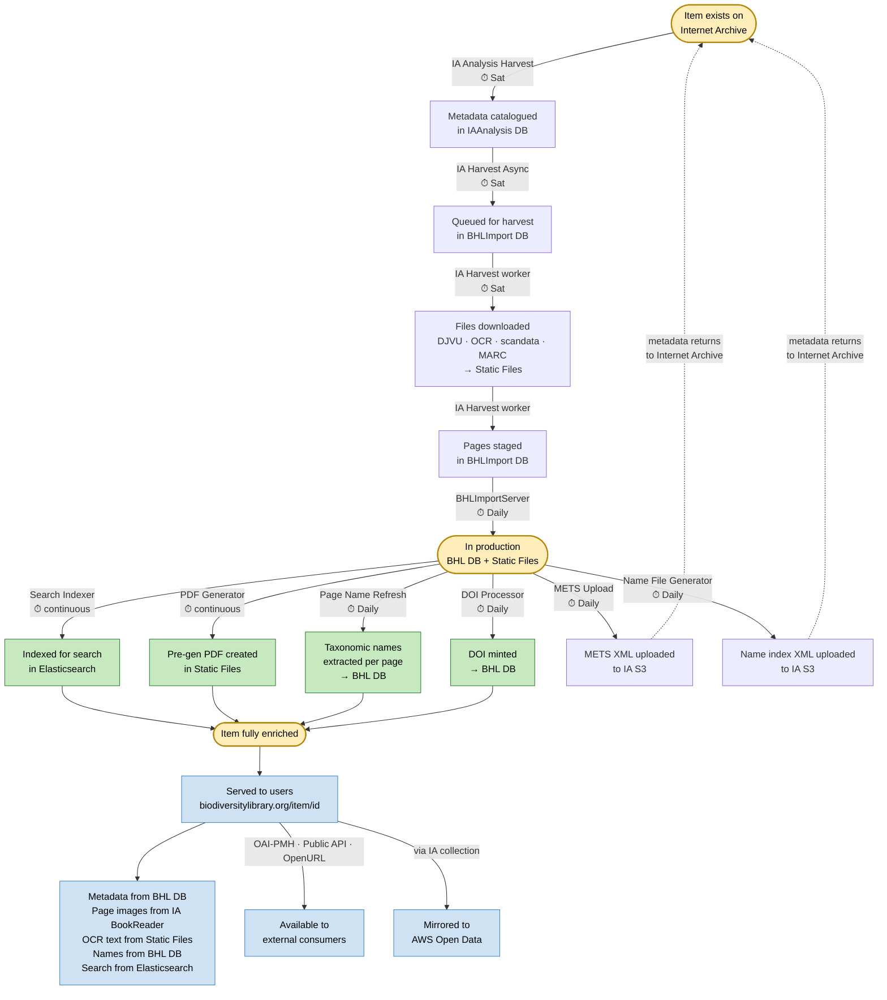

# Lifecycle of an Internet Archive item through BHL

Follow a single digitised book as it moves through BHL — from discovery on Internet Archive through harvest, enrichment, and serving, with metadata flowing back to IA to close the loop.

Each node is a **state the item is in**; each edge is labelled with the **service that transforms it**.

## The three milestones

The item passes through three key states (highlighted in yellow above):

1. **Exists on Internet Archive** — the starting point. The item is a digitised book hosted on IA, with DJVU page images, scandata, MARC metadata, and OCR text. BHL doesn't know about it yet.
2. **In production** — the item and its pages are now in BHL DB, with files on the shared file store. It's visible on the site but not yet fully enriched (no search entry, no names, no DOI, no PDF).
3. **Fully enriched** — search-indexed, PDF generated, per-page taxonomic names extracted, DOI minted (if applicable), and metadata uploaded back to IA. This is the steady state.

## The loop back to IA

Two services push metadata *back* to Internet Archive after the item is in production:

- **METS Upload** generates a METS XML file and uploads it to IA S3 (daily batch).
- **Name File Generator** generates a name-index XML file and uploads it to IA S3.

This closes the loop: the item started on IA, was harvested into BHL, was enriched, and then BHL's enrichments (structured metadata, taxonomic names) flow back to IA to sit alongside the original scans.

## Timing

Not everything happens at once. Based on BHL's actual task schedule (see `tasks.csv`):

| Stage | Schedule | Worst-case lag after item appears on IA |
|-------|----------|-----------------------------------------|
| Discovery (IA Analysis Harvest) | **Sat** | Up to 7 days (weekly) |
| Harvest (IA Harvest) | **Sat** | Same Saturday run (or the next one if discovery just ran) |
| Search indexing | **Continuous** (MQ consumer) | Seconds to minutes after harvest |
| PDF generation | **Continuous** (MQ consumer) | Minutes to hours after harvest |
| Name extraction (Page Name Refresh) | **Daily** | Up to 24 hours after harvest |
| DOI minting (DOI Processor) | **Daily** (submit + verify) | Up to 24 hours after harvest |
| METS upload to IA | **Daily** | Up to 24 hours after harvest |
| Name-file upload to IA | **Daily** | Up to 24 hours after harvest |
| Staging → production promotion | **Daily** (DB task) | Up to 24 hours for records staged in BHLImport DB |

The **IA harvest pipeline is the bottleneck**: both discovery and harvest run only on Saturdays. A new item uploaded to IA on Sunday won't enter BHL until the following Saturday — up to a week's lag. Once the item is harvested, downstream enrichment is much faster: search is near-real-time (continuous MQ consumer), and everything else runs daily.

A freshly harvested item will appear on the site searchable within minutes, but may lack names, a DOI, or a pre-generated PDF until the daily batch jobs run.

## What this reveals

- **IA is the alpha and the omega.** The item starts on IA, BHL enriches it, and enrichments flow back to IA. The user's browser also talks directly to IA for page images. BHL is never fully independent of IA for any item.
- **The harvest is the critical path.** If the IA Harvest worker fails, nothing downstream happens.
- **Enrichment is loosely coupled but laggy.** Each enrichment step runs on its own schedule, not event-driven. The trade-off is operational simplicity (no complex orchestration) at the cost of eventual consistency.
- **The item lives in many places at once.** After enrichment, data about this item exists in: BHL DB, Static Files, Elasticsearch, Internet Archive (METS + name files + original scans), and eventually AWS Open Data. There is no single source of truth — each store holds a different facet.
