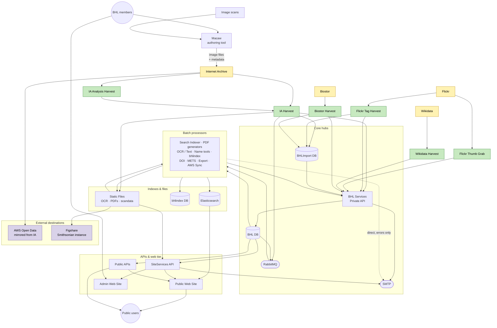

# BHL data flow — overview

High-level view of how data moves through BHL, organised top-down: external sources feed dedicated harvesters, which push into the core hubs; core data is then processed, indexed, stored, and served via the API / web tier (or pushed to external destinations).

Nodes are colour-coded by role: external sources (yellow), harvesters (green), external destinations (lavender). External sources are drawn independently — they are unrelated systems with distinct harvest pipelines. Audience is split into **public users** (who reach the Public Web Site and Public APIs) and **BHL members** (partner-institution staff who access the Admin Web Site and the Macaw authoring tool).

## Architectural hubs

Three components sit at the centre of the system and are worth naming explicitly:

- **BHL Services Private API** — the write-back gateway. Almost every background job commits data to the production database through this API rather than touching the DB directly.
- **RabbitMQ** — the async backbone decoupling search indexing and PDF generation from the processes that trigger them.
- **BHL DB** — the central production database that everything else orbits.

**BHLImport DB** acts as a staging layer: harvesters write raw / partial records here before the Private API promotes them into BHL DB. **bhlindex** (the Global Names tool) is grouped with the other batch processors on the diagram, but writes to its own PostgreSQL `bhlindex DB` — and **nothing in BHL reads that database back**. Treat it as a parallel name-index data product built from BHL content, not as a name source for the BHL site. Per-page names shown on biodiversitylibrary.org come from **BHL DB** instead, populated by `Page Name Refresh` using a different Global Names library (`gnfinder`) on OCR text.

## Macaw (standalone authoring tool)

Macaw (`/Users/rpage/Sites/macaw-book-metadata-tool`; see `diagrams/macaw.png`) is a PHP/CodeIgniter tool that partner institutions use to prepare page-level metadata for scanned books. **It does not interact with any BHL component.** A member feeds image scans and title metadata into Macaw, fills in item- and page-level metadata, and the export plugin uploads the resulting package (`_scandata.xml`, `_marc.xml`, `_jp2.zip`, `_bhlcreators.xml`) to Internet Archive via S3 using each partner's own IA credentials. Content reaches BHL only indirectly, via the standard IA Harvest pipeline — so Internet Archive appears on the diagram as both a source (for BHL) and a destination (for Macaw).

(The earlier source diagram's "Macaw Server" / "Macaw OAI Harvest" nodes misrepresented the flow: Macaw has no OAI-PMH endpoint — it consumes OAI feeds for import but does not expose one — and has no direct link to BHL's Public APIs, database, or services.)

## Harvest paths at a glance

| Source | Harvester(s) | Destination(s) |
|--------|-------------|---------------|
| Internet Archive | IA Analysis Harvest → IA Harvest | BHLImport DB, Static Files, RabbitMQ, BHL Services API |
| Flickr | Flickr Tag Harvest | BHLImport DB, BHL Services API |
| Flickr | Flickr Thumb Grab | BHL Services API |
| Wikidata | Wikidata Harvest | BHL Services API |
| Biostor | Biostor Harvest | BHLImport DB, BHL Services API |

Macaw-authored content reaches BHL indirectly via IA (see above).

## What's deliberately hidden here

- Individual batch processors (and `IAAnalysis DB`, which is specific to the IA ingest pipeline). Each is shown in the relevant lifecycle sub-diagram.
- Email-sender markers. ~20 components POST to an internal `/v1/Email` endpoint; only the two API → SMTP edges (plus one direct edge from the Search Indexer) are shown here. Individual senders are marked in the sub-diagrams.
- **IIIF.** Code exists in `BHLUSWeb2/Controllers/IIIFController.cs` and `IIIFUtility/`, but IIIF is not in production use. Page-image display currently delegates to the Internet Archive BookReader.
