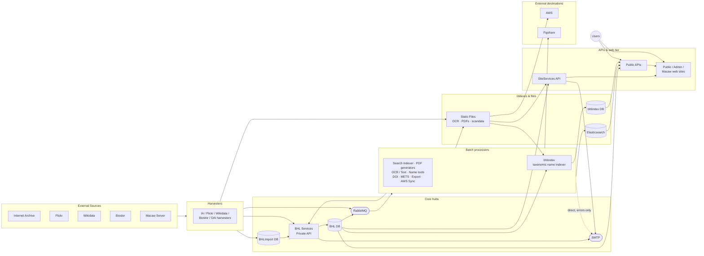

# BHL data flow — overview

High-level view of how data moves through BHL, organised by the data's journey: from external sources, through ingest, into the core hubs, out to processing and storage, and then served via the API / web tier (or pushed to external destinations).

## Architectural hubs

Three components sit at the centre of the system and are worth naming explicitly:

- **BHL Services Private API** — the write-back gateway. Almost every background job commits data to the production database through this API rather than touching the DB directly.
- **RabbitMQ** — the async backbone decoupling search indexing and PDF generation from the processes that trigger them.
- **BHL DB** — the central production database that everything else orbits.

**BHLImport DB** acts as a staging layer: harvesters write raw / partial records here before the Private API promotes them into BHL DB. **bhlindex** is a separate subsystem (PostgreSQL, running the Global Names tool) for taxonomic name indexing — it reads from BHL DB and Static Files but keeps its output in its own database rather than feeding back through the Private API.

## What's deliberately hidden here

- Individual harvesters and processors (and `IAAnalysis DB`, which is specific to the IA ingest pipeline). Each is shown in the relevant lifecycle sub-diagram.
- Email-sender markers. ~20 components POST to an internal `/v1/Email` endpoint; only the two API → SMTP edges (plus one direct edge from the Search Indexer) are shown here. Individual senders are marked in the sub-diagrams.
- **IIIF.** Code exists in `BHLUSWeb2/Controllers/IIIFController.cs` and `IIIFUtility/`, but IIIF is not in production use. Page-image display currently delegates to the Internet Archive BookReader.
