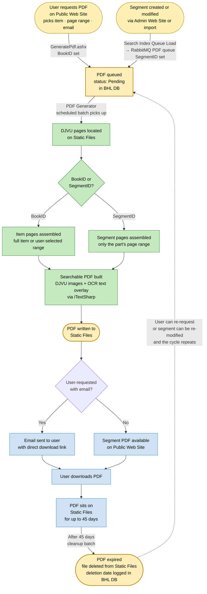

# Lifecycle of a BHL PDF

Follow a PDF from request through generation, delivery, and eventual expiry. BHL generates searchable PDFs (page images with an OCR text overlay) from DJVU source files. There are two trigger paths — user-requested and segment-based — but they converge on the same generator and follow the same lifecycle afterwards.



## Two trigger paths

| Path | Trigger | What's generated | Entry point |
|------|---------|-----------------|-------------|
| **User-requested** | User fills in a form on the Public Web Site, specifying item, page range, and email | PDF of the selected pages from the item (`BookID` set, `SegmentID` null) | `BHLUSWeb2/services/GeneratePdf.ashx.cs` → `BHLProvider.AddNewPdf()` |
| **Segment (part/article)** | A segment is created or modified (via Admin Web Site or import); `BHLSearchIndexQueueLoad` detects the change and publishes to the RabbitMQ PDF queue | PDF of the segment's page range only (`SegmentID` set, `BookID` null) | `BHLSearchIndexQueueLoad` → MQ message `put\|segment\|{SegmentID}\|page` |

Both paths create a `Pdf` record with status 10 (Pending) in BHL DB. The PDF Generator's `ProcessNewPdfs()` loop picks up every status-10 record regardless of origin.

**Note:** The MQ path only fires for segments on **non-IA items** (items where `BarCode IS NULL` in the audit stored procedure). IA-sourced items already have DJVUs on Internet Archive; their segment PDFs would be user-requested if needed.

## How the generator distinguishes

The PDF Generator decides what pages to include based on which ID is set (`BHLPDFGenerator/PDFDocument.cs:26`):

```
BookID set   → GetBookPages(BookID)    → all pages in the item (or user-selected subset)
SegmentID set → GetSegmentPages(SegmentID) → only the pages belonging to that part/article
```

## Generation

`BHLPDFGenerator/PDFGenerator.cs` runs as a scheduled batch. For each pending PDF:

1. Locates the relevant **DJVU files** on Static Files.
2. For each page, extracts the page image and the OCR word list with coordinate data from the DJVU.
3. Assembles a **searchable PDF** using iTextSharp: the page image (rescaled, JPEG quality 40) is the visible layer; the OCR text is positioned as a hidden selectable layer on top. The result looks like a scan but is full-text searchable and copy-pasteable.
4. Writes the finished PDF to **Static Files**.
5. Updates the PDF record status in BHL DB.

## Delivery

- **User-requested PDFs**: an email is sent to the address the user provided, containing a direct download link to the PDF on Static Files. The template (`ResponseEmail.txt`) includes the link, a note about browser PDF viewers, and optional article metadata (title / authors / subjects if the user provided them).
- **Segment PDFs**: available via the Public Web Site's part/segment page. No email — the PDF is just there for anyone viewing that segment.

## Expiry and cleanup

PDFs have a **45-day retention period**. A cleanup routine (`PDFSelectForDeletion` stored procedure) finds PDFs whose `FileGenerationDate` is more than 45 days old, deletes the file from Static Files, and logs the `FileDeletionDate` in BHL DB. Exception: if another Pending request points at the same file location (file reuse), the file is kept.

If a user requests the same PDF after it's been cleaned up, or a segment is modified again, a new Pending record is created and the cycle repeats.

## What this reveals

- **PDFs are ephemeral, not archival.** The 45-day TTL means PDFs are a cache, not a permanent artefact. The source of truth is always the DJVU files on Static Files (which came from IA during harvest).
- **The two trigger paths are invisible to the generator.** BookID-based and SegmentID-based PDFs sit in the same table with the same status. The generator doesn't care which path created the request — it just processes everything pending. Adding a third trigger (e.g. an API endpoint) would mean inserting a row, not touching the generator.
- **Segment PDFs are event-driven; user PDFs are on-demand.** Segment PDFs auto-regenerate when the segment changes, keeping them current. User-requested PDFs are one-shot: if the underlying pages change, the user would need to re-request.
- **The user email is the only "push" delivery in BHL.** Most of BHL is pull-based (user visits a page, browser fetches data). The PDF-ready email is the one place BHL proactively reaches out to a user.
