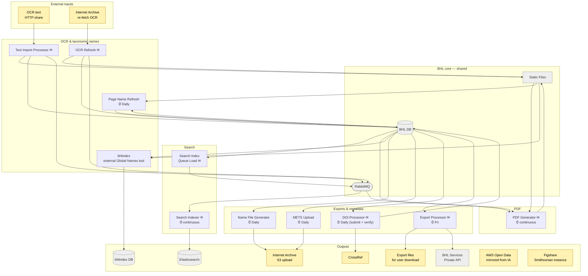

# Process

What happens to data once it's in BHL. Scope: the batch processors and queue consumers that enrich, index, transform, and publish content already present in `BHL DB` and `Static Files`. External inputs are at the top, the shared BHL-core boundary (read and written by Process) sits above the processors, and sinks — things only ever written to — are collected in an Outputs group at the bottom. Boundary nodes are shown muted; processors are grouped by role. The ✉ glyph on a node marks it as an email sender; email edges themselves are not drawn.

## What each processor does

### Search

- **Search Index Queue Load** (`BHLSearchIndexQueueLoad/`) — scheduled batch. Reads BHL DB audit tables and pushes messages into RabbitMQ. Despite the name it doesn't only feed the search index: it writes to separate queues for the Search Indexer, PDF Generator, and DOI Processor.
- **Search Indexer** (`BHLSearchIndexer/`) — continuous service. Consumes MQ messages, incrementally indexes items, pages, authors, keywords, and names into Elasticsearch (CATALOG / ITEMS / PAGES / AUTHORS / KEYWORDS / NAMES). **Talks to SMTP directly via MailKit for critical-error alerts** — the only in-repo component that bypasses the Private API's email endpoint.

### PDF

- **PDF Generator** (`BHLPDFGenerator/`) — scheduled batch. Reads pending PDF requests from BHL DB and PDF-queue messages from RabbitMQ, assembles pages from DJVU on `Static Files`, writes output PDFs back to `Static Files`, and **emails the requesting user directly** when each PDF is ready. There is only one PDF-builder project in `bhl-us`; the old diagram's Pre-Gen / Custom split doesn't correspond to separate executables.

### OCR & taxonomic names

- **Text Import Processor** (`BHLTextImportProcessor/`) — scheduled batch. Processes admin-created import batches: downloads OCR CSV files from a configured HTTP share, updates page text in BHL DB, writes the OCR text to `Static Files`, and pushes MQ messages so the Search Indexer and PDF Generator pick up the changes.
- **OCR Refresh** (`BHLOcrRefresh/`) — scheduled batch. Reads job files listing items whose OCR should be refreshed, re-fetches fresh OCR from Internet Archive, writes it to `Static Files`, updates BHL DB, pushes MQ for downstream indexing, and clears cached page names.
- **Page Name Refresh** (`BHLPageNameRefresh/`) — scheduled batch. Reads OCR from `Static Files`, uses the `gnfinder` library (from the Global Names project) to extract taxonomic names, and writes resolved names into BHL DB (`NamePage` / `Name` / `NameResolved` tables). This is the source of the per-page name lists shown on the live BHL site.
- **bhlindex** — **separate project** (Global Names tool; lives outside `bhl-us`). Reads BHL DB and `Static Files` and writes to its own PostgreSQL `bhlindex DB`. Despite the similar name, this is a *different* GN tool from the `gnfinder` library Page Name Refresh uses, and its output (bhlindex DB) is **not** read by any BHL component — treat it as a parallel name-index data product built from BHL content rather than a source the BHL site queries.

### Exports & metadata

- **Name File Generator** (`BHLNameFileGenerator/`) — scheduled batch. Generates name-index XML files from BHL DB and **uploads them back to Internet Archive S3** so IA items carry the BHL name index alongside their scandata.
- **METS Upload** (`BHLMETSUpload/`) — daily batch. Generates METS (Metadata Encoding & Transmission Standard) XML for items/segments changed in the last 24 hours and **uploads to Internet Archive S3**.
- **DOI Processor** (`BHLDOIService/`) — scheduled batch. Reads the DOI queue from BHL DB (populated by Search Index Queue Load), generates and submits CrossRef XML deposits, validates prior submissions, and writes DOI status back to BHL DB.
- **Export Processor** (`BHLExportProcessor/`) — scheduled batch. Pluggable export engine: runs configured exporters against BHL DB and writes export files (format depends on the exporter) to a location served by the Public Web Site.

## Email notifications

Every node marked with ✉ sends email at some point in its run. Email edges themselves are not drawn — the glyph on the node is enough. Two patterns coexist under the glyph:

- Most processors POST to `/v1/Email` on the BHL Services Private API, which talks to SMTP on their behalf. Admin summary/error notifications use this path.
- **Search Indexer** and **PDF Generator** talk to SMTP directly — the Search Indexer for critical-error alerts, the PDF Generator for "your PDF is ready" messages sent to the user who requested it.

## Downstream public datasets

Two destinations sit in the Outputs group with no incoming edges — their sync pipelines are **external to `bhl-us`**, and their node labels describe where the data originates rather than a diagram-drawn arrow:

- **AWS Open Data** — BHL content is published as an AWS Open Data dataset ([`registry.opendata.aws/bhl-open-data/`](https://registry.opendata.aws/bhl-open-data/)). BHL content on Internet Archive is converted and published to AWS by a separate pipeline (not a direct IA → AWS sync). No edge is drawn because the conversion/publishing step isn't something this diagram covers.
- **Figshare (Smithsonian instance)** — BHL deposits data dumps (notably OCR text) here. The export pipeline lives outside `bhl-us`.

Separately, **Name File Generator** and **METS Upload** upload XML back to **Internet Archive S3** using IA credentials — that's a within-Process back-channel and *is* drawn (`NameFile / METS → IA S3 upload`).

## Hand-off to Serve

Process leaves its results in the same four BHL-core landing points that Ingest populates:

- **BHL DB** — enriched records (names, OCR status, DOI status, PDF status).
- **Static Files** — generated PDFs, refreshed OCR, export files.
- **Elasticsearch** — up-to-date search index.
- **bhlindex DB** — resolved taxonomic names.

The Serve sub-diagram picks up from there.
