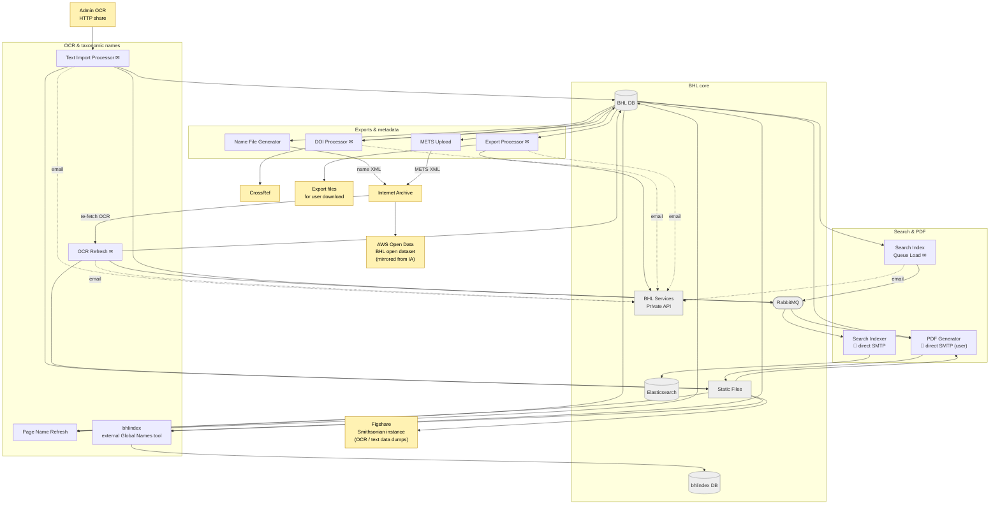

# Process

What happens to data once it's in BHL. Scope: the batch processors and queue consumers that enrich, index, transform, and publish content already present in `BHL DB` and `Static Files`. The core boundary (BHL DB, Static Files, RabbitMQ, Elasticsearch, bhlindex DB, Private API) is shown muted to keep the focus on the processors; the processors are grouped by role.

## What each processor does

### Search & PDF

- **Search Index Queue Load** (`BHLSearchIndexQueueLoad/`) — scheduled batch. Reads BHL DB audit tables, pushes index/PDF/DOI messages into the relevant RabbitMQ queues.
- **Search Indexer** (`BHLSearchIndexer/`) — continuous service. Consumes MQ messages, incrementally indexes items, pages, authors, keywords, and names into Elasticsearch (CATALOG / ITEMS / PAGES / AUTHORS / KEYWORDS / NAMES). **Talks to SMTP directly via MailKit for critical-error alerts** — the only in-repo component that bypasses the Private API's email endpoint.
- **PDF Generator** (`BHLPDFGenerator/`) — scheduled batch. Reads pending PDF requests from BHL DB and PDF-queue messages from RabbitMQ, assembles pages from DJVU on `Static Files`, writes output PDFs back to `Static Files`, and **emails the requesting user directly** when each PDF is ready. There is only one PDF-builder project in `bhl-us`; the old diagram's Pre-Gen / Custom split doesn't correspond to separate executables.

### OCR & taxonomic names

- **Text Import Processor** (`BHLTextImportProcessor/`) — scheduled batch. Processes admin-created import batches: downloads OCR CSV files from a configured HTTP share, updates page text in BHL DB, writes the OCR text to `Static Files`, and pushes MQ messages so the Search Indexer and PDF Generator pick up the changes.
- **OCR Refresh** (`BHLOcrRefresh/`) — scheduled batch. Reads job files listing items whose OCR should be refreshed, re-fetches fresh OCR from Internet Archive, writes it to `Static Files`, updates BHL DB, pushes MQ for downstream indexing, and clears cached page names.
- **Page Name Refresh** (`BHLPageNameRefresh/`) — scheduled batch. Reads OCR from `Static Files`, extracts taxonomic names, and writes resolved names back to BHL DB page records.
- **bhlindex** — **external project** (Global Names tool; lives outside `bhl-us`). Reads BHL DB and `Static Files` and writes to its own PostgreSQL `bhlindex DB`. BHL integrates with it as a consumer.

### Exports & metadata

- **Name File Generator** (`BHLNameFileGenerator/`) — scheduled batch. Generates name-index XML files from BHL DB and **uploads them back to Internet Archive S3** so IA items carry the BHL name index alongside their scandata.
- **METS Upload** (`BHLMETSUpload/`) — daily batch. Generates METS (Metadata Encoding & Transmission Standard) XML for items/segments changed in the last 24 hours and **uploads to Internet Archive S3**.
- **DOI Processor** (`BHLDOIService/`) — scheduled batch. Reads the DOI queue from BHL DB (populated by Search Index Queue Load), generates and submits CrossRef XML deposits, validates prior submissions, and writes DOI status back to BHL DB.
- **Export Processor** (`BHLExportProcessor/`) — scheduled batch. Pluggable export engine: runs configured exporters against BHL DB and writes export files (format depends on the exporter) to a location served by the Public Web Site.

## Email notifications

Two patterns coexist:

- Most processors POST to `/v1/Email` on the Private API (marked ✉). They're dashed in the diagram to distinguish email from data edges.
- **Search Indexer** and **PDF Generator** talk to SMTP directly — the Search Indexer for critical-error alerts (MailKit), the PDF Generator for "your PDF is ready" notifications to the user who requested it.

## Downstream public datasets

Two destinations on the diagram are real but their synchronisation is **not** driven by code in `bhl-us`:

- **AWS Open Data** — BHL content is published as an AWS Open Data dataset ([`registry.opendata.aws/bhl-open-data/`](https://registry.opendata.aws/bhl-open-data/)). The dataset is mirrored from the BHL collection on Internet Archive rather than pushed directly from BHL's Static Files, so the edge is drawn `IA → AWS`.
- **Figshare (Smithsonian instance)** — BHL deposits data dumps (notably OCR text) here. The export pipeline lives outside the `bhl-us` codebase.

Separately, **Name File Generator** and **METS Upload** upload XML back to **Internet Archive S3** using IA credentials. That's a within-Process back-channel to IA (not to AWS), and is drawn directly.

## Hand-off to Serve

Process leaves its results in the same four BHL-core landing points that Ingest populates:

- **BHL DB** — enriched records (names, OCR status, DOI status, PDF status).
- **Static Files** — generated PDFs, refreshed OCR, export files.
- **Elasticsearch** — up-to-date search index.
- **bhlindex DB** — resolved taxonomic names.

The Serve sub-diagram picks up from there.
