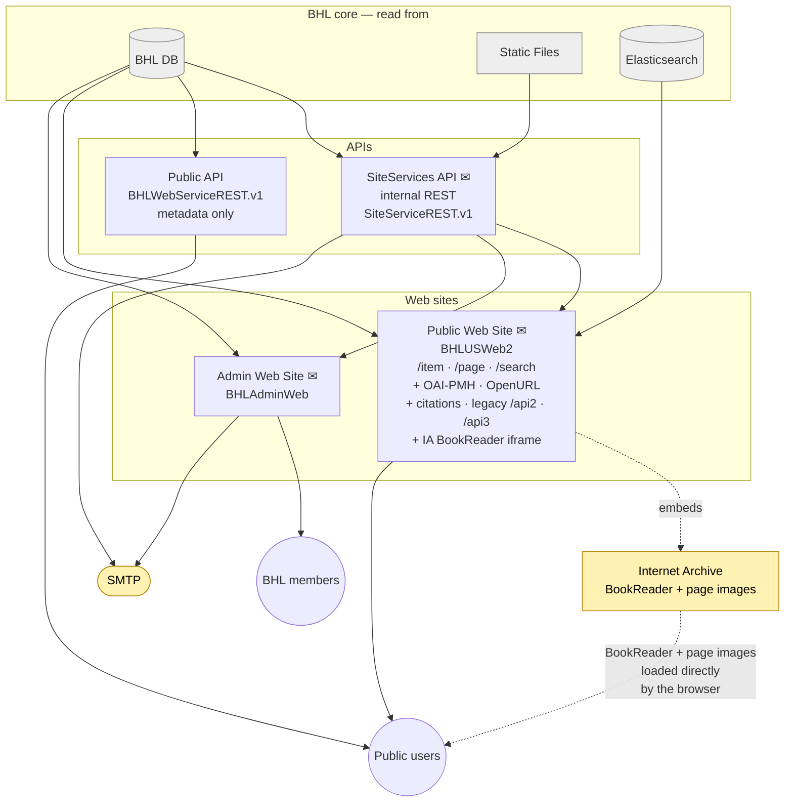

# Serve

How BHL content and metadata leave the building. Scope: the APIs and web sites that query the BHL core for reads, the specialised protocol endpoints BHL exposes (OAI-PMH, OpenURL, IIIF, citation downloads), the two audiences, and the external services (SMTP, Internet Archive) that sit outside BHL but are part of the user-visible flow.

The BHL-core boundary is shown muted at the top; APIs and web sites sit in the middle; audiences are at the bottom. External touch-points (IA, SMTP) sit to the side. The ✉ glyph marks email-sending components; email edges themselves aren't drawn.

## What each component does

### APIs

- **SiteServices API** (`SiteServiceREST.v1/`) — internal REST layer. Controllers include `EmailController`, `ItemsController`, `MarcFilesController`, `PagesController`, `DOIFilesController`, `OcrJobsController`, `SegmentsController`, `QueueMessagesController`, `MonitorController`. Reads BHL DB plus static files (page text, PDFs). Consumed by the Public and Admin web sites, and also by `NameFileGenerator` on the processing side. Sends transactional email via its `EmailController` (password reset, feedback, API-key delivery, etc).
- **Public API** (`BHLWebServiceREST.v1/`) — the modern external REST API. Seventeen controllers (Books, Pages, Titles, Items, Segments, DOI, Exports, …). Reads BHL DB **only** — no Elasticsearch, no bhlindex DB. Stateless metadata API.

### Web sites

- **Public Web Site** (`BHLUSWeb2/`) — hybrid ASP.NET Web Forms + MVC. Reads BHL DB (metadata), the SiteServices API (page text and PDFs), and Elasticsearch (all full-text / faceted search, via the `SearchElastic/` shared library). Hosts several protocol endpoints — see below.
- **Admin Web Site** (`BHLAdminWeb/`) — ASP.NET Web Forms with .ashx handlers and MVC services. Reads BHL DB directly via `BHLProvider`. Handles author/item curation, DOI assignment, user access, and account emails through its own `EmailService.cs` (so goes directly to SMTP rather than via an API).

### Protocols served by the Public Web Site

All hosted by `BHLUSWeb2` at distinct routes, so each is potentially a swap-point for future modularity:

- **Browse / search** — `/item/{id}`, `/page/{id}`, `/search`. Search queries go through `SearchController` → `SearchElastic` → Elasticsearch.
- **OAI-PMH server** — `/oai`. BHL exposes its own OAI-PMH feed via the `OAI2` library.
- **OpenURL resolver** — `/openurl`. Lets citation software link into BHL by standard OpenURL syntax.
- **Citation downloads** — MODS, BibTeX, RIS, CSL formats from `DownloadController`.
- **Legacy APIs** — `/api2` and `/api3` (the `BHLApi` project). Older REST endpoints, still active, that **do** query Elasticsearch via the same `SearchElastic` library the web UI uses. The newer `BHLWebServiceREST.v1` Public API is separate and does not.

## Page images: Internet Archive BookReader

BHL does **not** serve scanned page images from its own infrastructure. The item / page views on the Public Web Site embed the **Internet Archive BookReader** (a JS reader hosted by IA) in an iframe; the browser then talks directly to IA for page images. For any page view, the browser makes some requests to BHL (metadata, page text via SiteServices) and many more to IA (the reader assets and page image tiles).

**IIIF is not live at BHL.** The `/iiif/{itemId}/manifest` route and `IIIFController.cs` exist in `BHLUSWeb2`, but the production endpoint currently returns a 404 (e.g. `biodiversitylibrary.org/iiif/350452/manifest`). The `iiif.archivelab.org` image server that the manifests would reference is also returning 5xx errors at time of writing. So in practice IIIF is dormant, and IA BookReader is how items are read. The code is worth keeping track of as a future modularity option — but today it's not in the data flow.

## Email

Two senders in the Serve tier:

- **SiteServices API** handles email originating on the Public Web Site (feedback form, API-key delivery, "get my PDF" notifications that come through the API path, etc.) by exposing `/v1/Email` and forwarding to SMTP.
- **Admin Web Site** sends its own SMTP directly (account management, password reset), using `BHLAdminWeb/MVCServices/EmailService.cs`. It doesn't route through SiteServices.

(For a full inventory of email senders across BHL, see `memory/`. Process-tier senders live in `process.md`.)

## What's *not* here

- **bhlindex DB**. Earlier versions of the overview showed bhlindex DB feeding the Public API. A grep of the whole `bhl-us` codebase for `bhlindex` / `Npgsql` returns zero hits — nothing in BHL reads this database. The `bhlindex` Global Names *tool* writes to it, but those results never come back into any BHL query path that's visible in `bhl-us`. Treat bhlindex DB as a parallel name-index data product built *from* BHL content rather than *for* BHL's site.

  Per-page taxonomic names shown on biodiversitylibrary.org do **not** come from bhlindex DB. They come from **BHL DB** tables (`NamePage`, `Name`, `NameResolved`), populated by `BHLPageNameRefresh/` calling `gnfinder` (a separate Global Names library) on OCR text. The Public Web Site reaches them through `/services/PageSummaryService.ashx?op=GetPageNameList` → `BHLProvider.NameResolvedSelectByPageID` → SQL Server stored procedure.
- **BHL Services Private API (write gateway)**. It's a write-only concern, handled in Ingest and Process.
- **Macaw**. Standalone authoring tool that BHL hosts for partners but that has no read path back into BHL — see overview.
